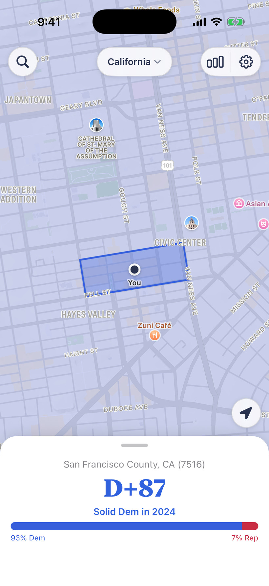
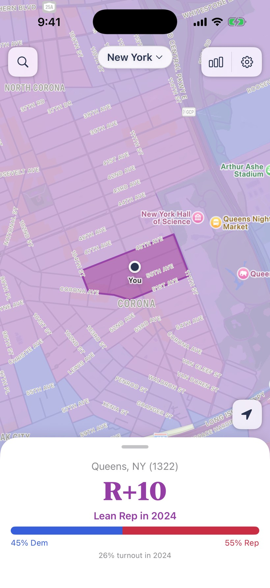
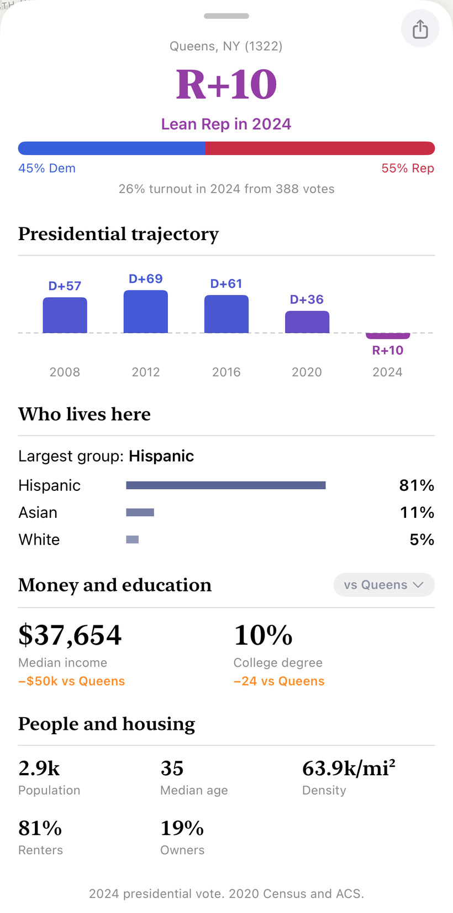

# Precinctly

A native iOS app and home/lock-screen widget that shows the political lean and demographics of the precinct you're standing in. A weather app, but for local election and census data: open the map and tap any precinct to see how it voted and who lives there, or glance at the widget for your current one.

Covers New York, California, Massachusetts, Texas, and the DMV (Washington, DC, Montgomery and Prince George's Counties, and Northern Virginia).

<p align="center">
  
  
  
</p>

## What it does

- **Map explorer.** Tap any precinct for its profile: presidential lean, median income, race and ethnicity, and other census demographics.
- **Widgets.** Home and lock-screen widgets read your current location and show the precinct around you.
- **Trends.** Where the data supports it (California), a precinct carries a 2016 to 2024 presidential trajectory instead of a single snapshot.

## How it's built

- **App:** SwiftUI and WidgetKit, managed with XcodeGen (`PrecinctWeather/project.yml` is the source of truth). A `PrecinctKit` framework wraps a bundled SQLite database that the app reads directly on device.
- **Data pipeline:** a set of Python scripts build the bundled database from public sources, Census VTDs plus precinct-level election returns from SWDB, ALARM, and VEST, with per-state map reprojection. The DMV extension is prepared from a privately supplied curated dataset and public DC geometry controls.

## A note on the data

Real demographic data is messy, and the app tries to be honest about it rather than paper over it:

- Income is top-coded by the Census at $250k, so it's shown as "$250k+".
- The Census counts race and Hispanic/Latino ethnicity separately, so race shares can overlap and add up past 100%. The app surfaces that in an info panel instead of forcing a fake clean split.

## Layout

```
PrecinctWeather/     SwiftUI app + WidgetKit extension
  App/               map, profile sheet, search, onboarding, settings
  PrecinctKit/       SQLite + profile framework (bundled DB)
  Widget/            home + lock-screen widget
*.py                 data pipeline: public sources -> bundled DB
site/                landing page
```
