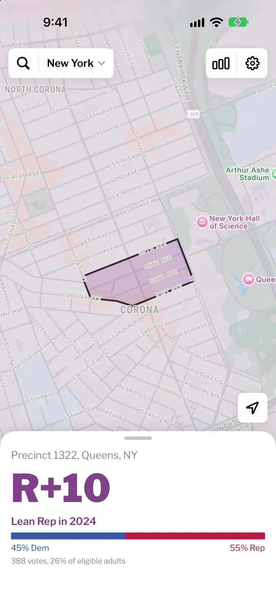
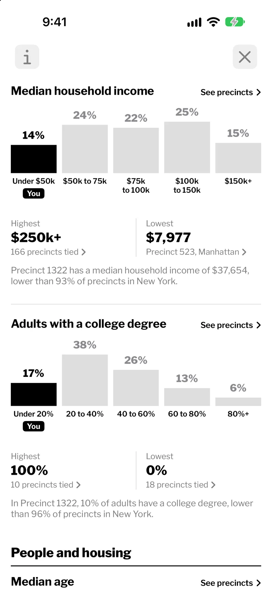
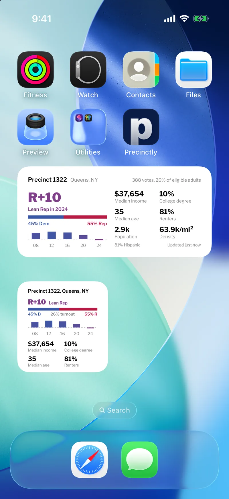

# Precinctly

A native iOS app and home/lock-screen widget that shows the political lean and demographics of the precinct you're standing in. A weather app, but for local election and census data: open the map and tap any precinct to see how it voted and who lives there, or glance at the widget for your current one.

Covers New York, California, Colorado, Massachusetts, Oregon, Texas, and the DMV (Washington, DC, Montgomery and Prince George's Counties, and Northern Virginia).

<p align="center">
  
  
  
</p>

## What it does

- **Map and card.** Tap any precinct for its card: presidential margin, results in earlier races, race and ethnicity, median income, college degrees, age, density and housing.
- **By the Numbers.** Charts of how every precinct in a state or county spreads out on each measure, with your precinct marked. Tap a bar to list its precincts, sorted either way, and tap one to open it on the map.
- **Widgets.** Home and Lock Screen widgets read your location and show the precinct you are in.
- **Share card.** Any precinct's card can be shared as an image.
- **Trends.** Where the data supports it, a precinct carries earlier presidential results instead of a single snapshot. California spans 2016 to 2024. Most Oregon and Colorado precincts also include earlier results.

Get it on the [App Store](https://apps.apple.com/us/app/precinctly/id6792189622). The landing page is at [precinct.ethangao.xyz](https://precinct.ethangao.xyz).

## How it's built

- **App:** SwiftUI and WidgetKit, managed with XcodeGen (`PrecinctWeather/project.yml` is the source of truth). A `PrecinctKit` framework wraps a bundled SQLite database that the app reads directly on device.
- **Data pipeline:** Python scripts build the public-source base from Census VTDs and precinct-level election returns from SWDB, ALARM, and VEST, with per-state map reprojection. The DMV, Oregon, and Colorado additions use privately supplied curated datasets. Public controls and focused verifiers check the resulting local bundle before release.

## A note on the data

Real demographic data is messy, and the app tries to be honest about it rather than paper over it:

- Income is top-coded by the Census at $250k, so it's shown as "$250k+".
- The Census counts race and Hispanic/Latino ethnicity separately, so race shares can overlap and add up past 100%. The app surfaces that in an info panel instead of forcing a fake clean split.

## Layout

```
PrecinctWeather/     SwiftUI app + WidgetKit extension
  App/               map, profile sheet, search, onboarding, settings
  PrecinctKit/       SQLite + profile framework (bundled DB)
  Widget/            home + lock-screen widget
pipeline/            data pipeline and source checks
scripts/test.py      local regression runner
site/                landing page
```

## Testing

See [TESTING.md](TESTING.md) for the regression command, setup and core user-flow checklist.
Public CI runs the portable Python and repository checks. Full iOS tests require the local
bundled database, Xcode and an iOS Simulator runtime. A public clone does not include the
private input data or the shipping database, and cannot reproduce the full current bundle.
